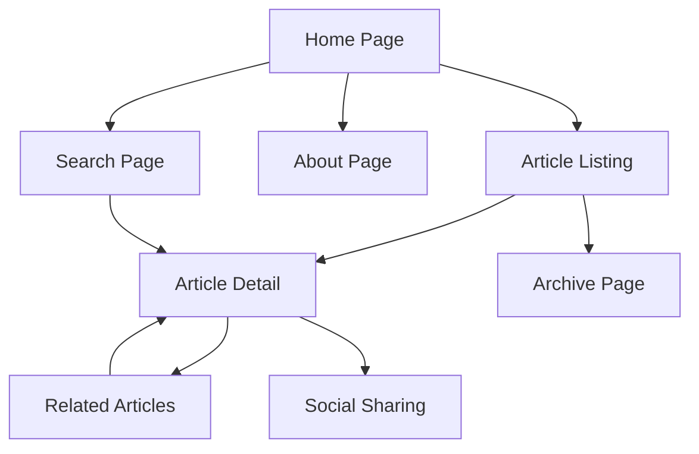

# Hugo Personal Tech Blog - Product Requirements Document

## 1. Product Overview
A modern, high-performance personal tech blog built with Hugo static site generator and the Stack theme, designed for a Senior DevOps engineer to share technical insights and expertise.

The blog will serve as a professional platform for publishing technical articles, tutorials, and DevOps best practices, targeting fellow engineers and tech enthusiasts. The goal is to establish thought leadership in the DevOps community while maintaining optimal performance and reliability.

## 2. Core Features

### 2.1 User Roles
| Role | Registration Method | Core Permissions |
|------|---------------------|------------------|
| Blog Owner | Direct access to Hugo source | Full content management, site configuration, deployment control |
| Readers | No registration required | Browse articles, search content, subscribe to RSS feeds |

### 2.2 Feature Module
Our Hugo tech blog consists of the following main pages:
1. **Home page**: hero section with author introduction, featured articles, recent posts, navigation menu
2. **Article listing page**: categorized posts, tag filtering, search functionality, pagination
3. **Article detail page**: full article content, code syntax highlighting, table of contents, social sharing
4. **About page**: professional background, expertise areas, contact information
5. **Archive page**: chronological post listing, category and tag organization
6. **Search page**: full-text search functionality with results filtering

### 2.3 Page Details
| Page Name | Module Name | Feature description |
|-----------|-------------|---------------------|
| Home page | Hero section | Display author introduction, professional title, key expertise areas with animated elements |
| Home page | Featured articles | Showcase 3-4 most important or recent technical posts with thumbnails |
| Home page | Recent posts | List latest 6-8 blog posts with excerpts, publication dates, and read time estimates |
| Home page | Navigation menu | Responsive navigation with categories, about, archive, and search functionality |
| Article listing | Post grid | Display articles in card format with thumbnails, titles, excerpts, tags, and metadata |
| Article listing | Category filter | Filter posts by DevOps, Cloud, Automation, Monitoring, and other technical categories |
| Article listing | Tag system | Tag-based filtering for specific technologies (Docker, Kubernetes, AWS, etc.) |
| Article listing | Pagination | Navigate through multiple pages of articles with SEO-friendly URLs |
| Article detail | Content rendering | Display full article with Markdown support, code syntax highlighting, and responsive design |
| Article detail | Table of contents | Auto-generated TOC for easy navigation within long technical articles |
| Article detail | Code blocks | Syntax highlighting for multiple programming languages with copy functionality |
| Article detail | Social sharing | Share buttons for LinkedIn, Twitter, and other professional networks |
| Article detail | Related posts | Suggest similar articles based on tags and categories |
| About page | Professional profile | Detailed background, certifications, current role, and technical expertise |
| About page | Contact form | Contact information and social media links for professional networking |
| Archive page | Chronological listing | All posts organized by year and month with quick navigation |
| Archive page | Category organization | Posts grouped by technical categories with post counts |
| Search page | Full-text search | Search functionality across all content with highlighted results |
| Search page | Filter options | Refine search results by date, category, and tags |

## 3. Core Process
**Content Creation Flow:**
Blog owner creates new articles using Markdown in Hugo content directory → writes technical content with code examples → adds appropriate tags and categories → commits to Git repository → triggers automated deployment via Vercel → content goes live on custom domain.

**Reader Experience Flow:**
Reader visits kowlon.my.id → browses featured articles or recent posts → clicks on article of interest → reads full content with syntax-highlighted code → shares article or explores related posts → optionally searches for specific topics.

## 4. User Interface Design
### 4.1 Design Style
- **Primary colors**: Dark theme with accent colors (#007acc for links, #1a1a1a for backgrounds)
- **Secondary colors**: Light gray (#f5f5f5) for contrast, green (#28a745) for success states
- **Button style**: Rounded corners with subtle shadows and hover animations
- **Font**: Inter or system fonts for readability, JetBrains Mono for code blocks
- **Layout style**: Card-based design with clean spacing, responsive grid system
- **Icons**: Feather icons or similar minimalist icon set for consistency

### 4.2 Page Design Overview
| Page Name | Module Name | UI Elements |
|-----------|-------------|-------------|
| Home page | Hero section | Large banner with professional headshot, animated typing effect for title, gradient background |
| Home page | Featured articles | 3-column grid on desktop, single column on mobile, hover effects with image overlays |
| Home page | Recent posts | Clean card layout with consistent spacing, thumbnail images, and metadata badges |
| Article listing | Post grid | Masonry or grid layout with consistent card heights, category color coding |
| Article detail | Content area | Maximum 800px width for readability, generous line spacing, responsive images |
| Article detail | Code blocks | Dark theme syntax highlighting, copy button, language labels |
| About page | Profile section | Professional layout with skills visualization, timeline of experience |
| Search page | Search interface | Prominent search bar, filter sidebar, results with highlighted search terms |

### 4.3 Responsiveness
Mobile-first responsive design with breakpoints at 768px (tablet) and 1024px (desktop). Touch-optimized navigation and interactions for mobile devices, with progressive enhancement for larger screens.