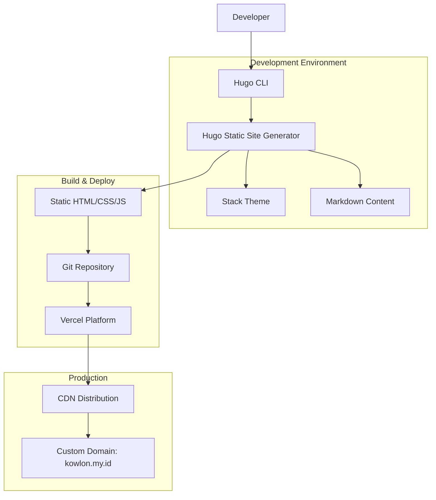

# Hugo Personal Tech Blog - Technical Architecture Document

## 1. Architecture Design



## 2. Technology Description
- Frontend: Hugo Static Site Generator + Stack Theme + Tailwind CSS
- Deployment: Vercel Platform with Git integration
- Domain: Custom domain (kowlon.my.id) with SSL/TLS
- Version Control: Git with GitHub/GitLab repository
- Content: Markdown files with front matter

## 3. Route Definitions
| Route | Purpose |
|-------|----------|
| / | Home page with hero section and featured articles |
| /posts/ | Article listing page with pagination |
| /posts/{slug}/ | Individual article detail pages |
| /about/ | About page with professional profile |
| /archives/ | Chronological archive of all posts |
| /categories/ | Category listing page |
| /categories/{category}/ | Posts filtered by specific category |
| /tags/ | Tag cloud and listing |
| /tags/{tag}/ | Posts filtered by specific tag |
| /search/ | Search functionality page |
| /rss.xml | RSS feed for content syndication |
| /sitemap.xml | XML sitemap for SEO |

## 4. Hugo Configuration

### 4.1 Core Configuration (hugo.toml)
```toml
baseURL = "https://kowlon.my.id"
languageCode = "en-us"
title = "Kowlon's Tech Blog"
theme = "hugo-theme-stack"

# Build configuration
buildDrafts = false
buildFuture = false
buildExpired = false
enableRobotsTXT = true
enableGitInfo = true
enableEmoji = true

# Pagination
paginate = 10
paginatePath = "page"

# Syntax highlighting
[markup]
  [markup.goldmark]
    [markup.goldmark.renderer]
      unsafe = true
  [markup.highlight]
    style = "github-dark"
    lineNos = true
    lineNumbersInTable = true
    tabWidth = 4

# Menu configuration
[menu]
  [[menu.main]]
    identifier = "home"
    name = "Home"
    url = "/"
    weight = 10
  [[menu.main]]
    identifier = "archives"
    name = "Archives"
    url = "/archives/"
    weight = 20
  [[menu.main]]
    identifier = "about"
    name = "About"
    url = "/about/"
    weight = 30

# Site parameters
[params]
  mainSections = ["posts"]
  featuredImageField = "image"
  rssFullContent = true
  favicon = "/favicon.ico"
  
  [params.footer]
    since = 2024
    customText = "Senior DevOps Engineer sharing technical insights"
  
  [params.dateFormat]
    published = "Jan 02, 2006"
    lastUpdated = "Jan 02, 2006 15:04 MST"
  
  [params.sidebar]
    emoji = "🚀"
    subtitle = "DevOps Engineer & Cloud Architect"
    avatar = "/images/avatar.jpg"
  
  [params.article]
    math = true
    toc = true
    readingTime = true
    license = ""
  
  [params.comments]
    enabled = false
  
  [params.widgets]
    homepage = ["recent", "categories", "tag-cloud"]
    page = ["toc"]
```

### 4.2 Content Structure
```
content/
├── posts/
│   ├── _index.md
│   ├── devops-best-practices/
│   │   ├── index.md
│   │   └── images/
│   ├── kubernetes-deployment/
│   │   ├── index.md
│   │   └── diagrams/
│   └── ci-cd-pipeline/
│       ├── index.md
│       └── screenshots/
├── about/
│   └── index.md
└── archives/
    └── _index.md
```

## 5. Deployment Architecture

### 5.1 Vercel Configuration
```json
{
  "version": 2,
  "builds": [
    {
      "src": "package.json",
      "use": "@vercel/static-build",
      "config": {
        "distDir": "public"
      }
    }
  ],
  "build": {
    "env": {
      "HUGO_VERSION": "0.120.0"
    }
  },
  "functions": {},
  "headers": [
    {
      "source": "/(.*)",
      "headers": [
        {
          "key": "X-Content-Type-Options",
          "value": "nosniff"
        },
        {
          "key": "X-Frame-Options",
          "value": "DENY"
        },
        {
          "key": "X-XSS-Protection",
          "value": "1; mode=block"
        }
      ]
    },
    {
      "source": "/static/(.*)",
      "headers": [
        {
          "key": "Cache-Control",
          "value": "public, max-age=31536000, immutable"
        }
      ]
    }
  ]
}
```

### 5.2 Package.json for Vercel
```json
{
  "name": "kowlon-tech-blog",
  "version": "1.0.0",
  "description": "Personal tech blog built with Hugo and Stack theme",
  "scripts": {
    "build": "hugo --minify",
    "dev": "hugo server -D",
    "clean": "rm -rf public"
  },
  "repository": {
    "type": "git",
    "url": "https://github.com/kowlon/personal-blog"
  },
  "keywords": ["hugo", "blog", "devops", "tech"],
  "author": "Kowlon",
  "license": "MIT"
}
```

## 6. CI/CD Pipeline

### 6.1 GitHub Actions Workflow
```yaml
name: Deploy Hugo Blog

on:
  push:
    branches: [ main ]
  pull_request:
    branches: [ main ]

jobs:
  build-and-deploy:
    runs-on: ubuntu-latest
    
    steps:
    - name: Checkout repository
      uses: actions/checkout@v4
      with:
        submodules: recursive
        fetch-depth: 0
    
    - name: Setup Hugo
      uses: peaceiris/actions-hugo@v2
      with:
        hugo-version: '0.120.0'
        extended: true
    
    - name: Build Hugo site
      run: hugo --minify
    
    - name: Deploy to Vercel
      uses: amondnet/vercel-action@v25
      with:
        vercel-token: ${{ secrets.VERCEL_TOKEN }}
        vercel-org-id: ${{ secrets.ORG_ID }}
        vercel-project-id: ${{ secrets.PROJECT_ID }}
        working-directory: ./
```

## 7. Performance Optimization

### 7.1 Hugo Build Optimization
- Enable minification for HTML, CSS, and JS
- Optimize images using Hugo's image processing
- Implement lazy loading for images
- Use WebP format for better compression
- Enable Gzip compression via Vercel

### 7.2 SEO Configuration
```yaml
# Front matter template for posts
---
title: "Article Title"
date: 2024-01-15T10:00:00+07:00
draft: false
author: "Kowlon"
description: "Brief article description for SEO"
tags: ["devops", "kubernetes", "automation"]
categories: ["DevOps"]
image: "featured-image.jpg"
slug: "article-url-slug"
---
```

## 8. Security & Monitoring

### 8.1 Security Headers
- Content Security Policy (CSP)
- X-Frame-Options: DENY
- X-Content-Type-Options: nosniff
- X-XSS-Protection: 1; mode=block
- Strict-Transport-Security for HTTPS

### 8.2 Monitoring Setup
- Vercel Analytics for performance monitoring
- Google Analytics 4 for visitor tracking
- Uptime monitoring via external service
- Core Web Vitals monitoring

## 9. Domain Configuration

### 9.1 DNS Settings for kowlon.my.id
```
Type: CNAME
Name: @
Value: cname.vercel-dns.com

Type: CNAME
Name: www
Value: cname.vercel-dns.com
```

### 9.2 SSL/TLS Configuration
- Automatic SSL certificate provisioning via Vercel
- HTTP to HTTPS redirect
- HSTS header implementation
- Certificate auto-renewal

## 10. Content Management Workflow

### 10.1 Article Creation Process
1. Create new branch for article
2. Add Markdown file in `content/posts/article-name/`
3. Include images in article subdirectory
4. Test locally with `hugo server -D`
5. Commit and push to trigger deployment
6. Merge to main branch for production

### 10.2 Backup Strategy
- Git repository serves as primary backup
- Automated daily backups to cloud storage
- Version control for all content changes
- Export functionality for content migration