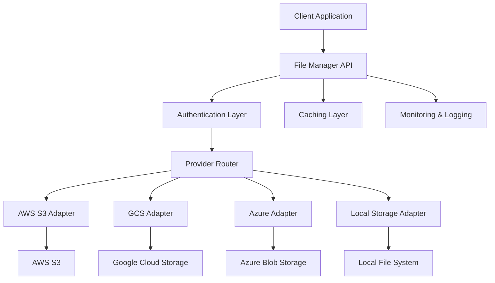

## The Problem: Cloud Storage Fragmentation

In today's multi-cloud world, organizations often find themselves using multiple cloud storage providers:

- **AWS S3** for primary storage
- **Google Cloud Storage** for analytics workloads
- **Azure Blob Storage** for enterprise integration
- **Local storage** for development and testing

Each provider has its own:
- 🔧 API specifications
- 🔐 Authentication mechanisms
- 📝 Data formats and structures
- 🚀 Performance characteristics

This fragmentation creates complexity for developers and operations teams.

## The Solution: Universal File Manager Middleware

We built a middleware layer that provides a **unified API interface** for all cloud storage operations, abstracting away provider-specific implementations.

### Key Features

✅ **Provider Agnostic**: Single API for multiple cloud providers

✅ **Seamless Integration**: Drop-in replacement for existing storage calls

✅ **Performance Optimized**: Intelligent routing and caching

✅ **Security First**: Centralized authentication and authorization

✅ **Monitoring & Observability**: Comprehensive logging and metrics

## Architecture Overview



## Core Components

### 1. Provider Abstraction Layer

```typescript
interface StorageProvider {
  upload(file: File, path: string): Promise<UploadResult>;
  download(path: string): Promise<File>;
  delete(path: string): Promise<boolean>;
  list(prefix?: string): Promise<FileMetadata[]>;
  getMetadata(path: string): Promise<FileMetadata>;
}
```

### 2. Configuration Management

```yaml
providers:
  aws:
    region: us-east-1
    bucket: my-app-storage
    credentials:
      access_key: ${AWS_ACCESS_KEY}
      secret_key: ${AWS_SECRET_KEY}
  
  gcs:
    project_id: my-project
    bucket: my-app-gcs-storage
    credentials_path: /path/to/service-account.json
  
  azure:
    account_name: myaccount
    container: my-container
    connection_string: ${AZURE_STORAGE_CONNECTION}
```

### 3. Intelligent Routing

```typescript
class ProviderRouter {
  route(operation: StorageOperation): StorageProvider {
    // Route based on:
    // - File type and size
    // - Geographic location
    // - Cost optimization
    // - Performance requirements
    // - Compliance needs
  }
}
```

## Implementation Highlights

### Multi-Provider Support

- **AWS S3**: Primary storage for production workloads
- **Google Cloud Storage**: Analytics and ML data
- **Azure Blob Storage**: Enterprise integration
- **Local Storage**: Development and testing

### Smart Caching

- **Redis-based caching** for frequently accessed files
- **CDN integration** for static assets
- **Intelligent cache invalidation** strategies

### Security & Compliance

- **Centralized authentication** with JWT tokens
- **Role-based access control** (RBAC)
- **Encryption at rest and in transit**
- **Audit logging** for compliance

### Performance Optimization

- **Parallel uploads** for large files
- **Chunked transfer** for better reliability
- **Connection pooling** for efficiency
- **Retry mechanisms** with exponential backoff

## API Examples

### Upload File

```bash
curl -X POST \
  -H "Authorization: Bearer ${TOKEN}" \
  -F "file=@document.pdf" \
  -F "path=/documents/2024/" \
  -F "provider=auto" \
  https://api.filemanager.com/v1/upload
```

### Download File

```bash
curl -X GET \
  -H "Authorization: Bearer ${TOKEN}" \
  https://api.filemanager.com/v1/download/documents/2024/document.pdf
```

### List Files

```bash
curl -X GET \
  -H "Authorization: Bearer ${TOKEN}" \
  "https://api.filemanager.com/v1/list?prefix=/documents/2024/"
```

## Benefits Achieved

### For Developers
- 🚀 **Faster Development**: Single API to learn and use
- 🔧 **Easier Testing**: Mock providers for unit tests
- 📚 **Better Documentation**: Unified API documentation

### For Operations
- 📊 **Centralized Monitoring**: Single dashboard for all storage
- 💰 **Cost Optimization**: Intelligent provider selection
- 🔒 **Enhanced Security**: Centralized access control

### For Business
- 🏃‍♂️ **Faster Time to Market**: Reduced development complexity
- 💵 **Cost Savings**: Optimized storage costs
- 🔄 **Vendor Flexibility**: Easy provider switching

## Monitoring & Observability

### Key Metrics
- **Request latency** per provider
- **Error rates** and failure patterns
- **Storage costs** and usage patterns
- **Cache hit rates** and performance

### Alerting
- **High error rates** from specific providers
- **Unusual cost spikes** or usage patterns
- **Performance degradation** alerts
- **Security incidents** and access violations

## Future Enhancements

1. **AI-Powered Optimization**
   - Machine learning for provider selection
   - Predictive caching strategies
   - Automated cost optimization

2. **Advanced Features**
   - File versioning and history
   - Automated backup and replication
   - Content delivery network integration

3. **Enterprise Features**
   - Multi-tenant support
   - Advanced compliance reporting
   - Integration with enterprise identity providers

## Lessons Learned

1. **Start Simple**: Begin with core operations before adding complexity
2. **Provider Differences**: Each cloud provider has unique characteristics
3. **Error Handling**: Robust retry and fallback mechanisms are crucial
4. **Testing Strategy**: Comprehensive testing across all providers
5. **Documentation**: Clear API documentation accelerates adoption

## Conclusion

Building a universal file manager middleware has significantly simplified our cloud storage operations while providing flexibility and cost optimization. The abstraction layer allows teams to focus on business logic rather than provider-specific implementations.

The key to success is balancing simplicity with functionality, ensuring the middleware adds value without introducing unnecessary complexity.

---

*This architecture has been successfully deployed in production, handling millions of file operations daily across multiple cloud providers.*

**Tags:** #CloudStorage #Middleware #API #DevOps #Architecture #MultiCloud