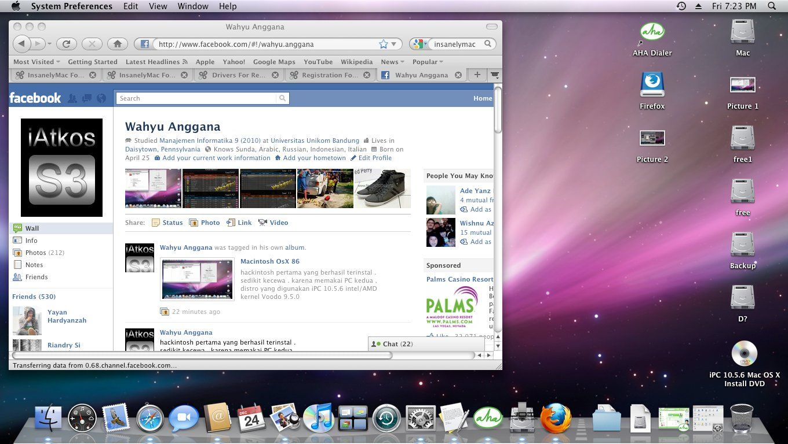

## Awal Mula Ketertarikan dengan macOS

Pertama tahu ada Mac itu ketika OS masih Tiger, coba browsing-browsing tipis ngulik-ngulik apa bisa install Mac OS di laptop kentang. Ternyata pada zaman itu ada yang namanya **hackintosh**.

Setelah serius research akhirnya dapat jawaban jika hackintosh itu:

1. **Bisa di install di intel based x86 CPU** dengan limitasi di setiap seri CPU, artinya ga bisa support di semua intel based juga, masalahnya prosesor saya AMD
2. **Driver VGA** itu bisa di install tanpa kendala biasanya di GPU intel atau radeon, karena iMac jaman dulu itu justru lebih familiar dengan radeon GPU. Masalahnya VGA saya NVIDIA
3. **Masalah kompatibilitas lain** seperti chipset, network card, audio card, dll
4. **Sulit bikin booting OSX** jika pakai Windows (belom punya Mac beneran)

## Spesifikasi Laptop Kentang Pertama

**Acer Aspire 4520G**
- AMD Mobile Turion 64 X2 TL-60
- Nvidia Nforce 630M
- 2GB DDR2 Memory
- 160 GB SATA HDD

Sangat kentang bukan?

## Perjuangan Install Hackintosh

Long story short akhirnya belajar:
- Install bikin booting Mac dari Windows
- Fixing gagal booting
- Patch kexts (semacam drivers)
- Re-partition disk
- Mainan di partition type EFI/MBR/GPT
- Kernel panic dll

Dengan penuh perjuangan dan learning, akhirnya berhasil install OSX di laptop di **2010**.

Pada saat itu saya menyadari perbedaan Mac dan Windows dengan spek yang sama, editing gambar video lebih smooth tapi karena ini bukan official hardware tetap ada limitasi di kompatibilitas hardware lain, contoh misal ga bisa jalan speaker nya sebelah atau port USB cuma bisa jalan 1 saja.

## Perjalanan Hackintosh Selanjutnya

Next success install di PC dan Laptop lain:

1. **AMD Phenom II X4 PC** → OS X 10.8 Mountain Lion
2. **Intel i5 Lenovo Z400** → Mac OS X 10.6 Snow Leopard
3. **AMD E350 Asus EEE PC 1215B** → Mac OS X 10.6 Snow Leopard
4. **Setup Ryzentosh di Ryzen 3500x** - saya sempat bikin racikan nya di repository saya

## Era Modern Hackintosh

And this day, install hackintosh itu bisa lebih mudah menggunakan **OpenCore**. Dan yang lebih geleng-geleng kepala lagi sekarang bisa running di atas **Docker**!

## Akhirnya Merasakan Mac Resmi

Alhamdulillah sempat merasakan juga hardware Mac official ga hack-hackan lagi beberapa hardware Mac:

1. **MacBook Pro 2017 i5**
2. **MacBook Pro M1**
3. **MacBook Pro M2**
4. **MacBook Pro M4 Pro**

## Hikmah dan Relevansi dengan Karier

Dari perjalanan ini, saya belajar bahwa **hobi ngoprek bisa berubah jadi passion**. Proses memahami:
- Hardware
- Software
- Instalasi
- Troubleshooting

Semuanya memperkaya pengetahuan. Sampai akhirnya sangat relevan dengan dunia yang saya tekuni sekarang: **DevOps & Infrastructure**.

Kadang hal kecil yang dimulai dari rasa penasaran justru bisa mengarahkan kita ke karier dan dunia kerja yang kita sukai.

---

*Artikel ini diadaptasi dari post LinkedIn saya tentang perjalanan panjang bersama macOS.*